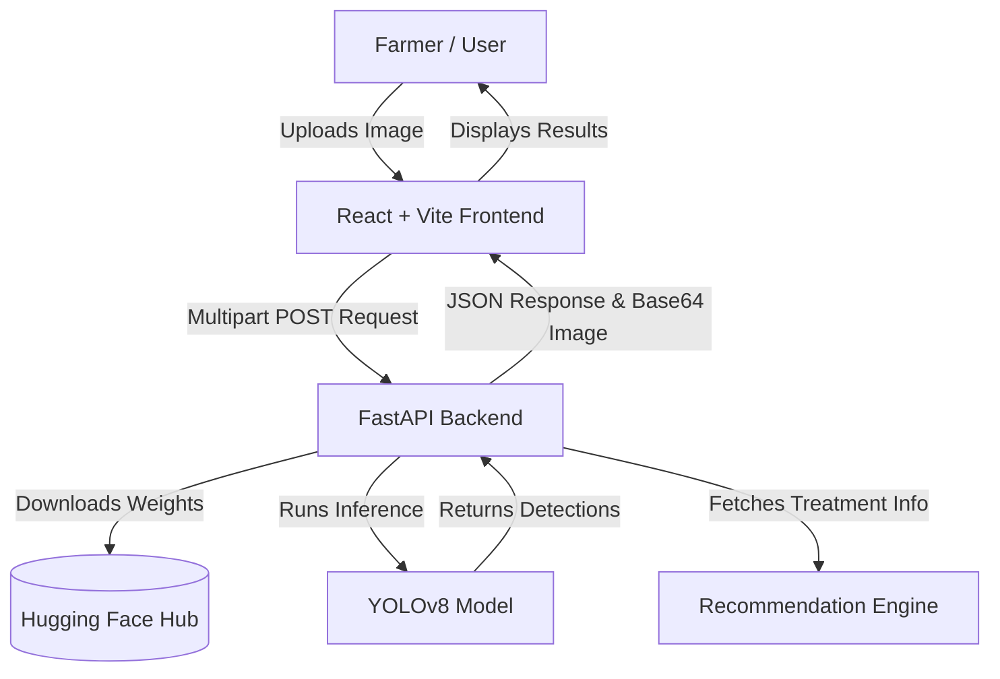

# AgriSentry: AI-Powered Pest Detection for Indian Agriculture

    

## Overview

Crop loss due to pest infestation is a critical challenge for India's agricultural sector. **AgriSentry** is an end-to-end deep learning web application designed to empower farmers by turning a standard smartphone into a powerful diagnostic tool. By leveraging a fine-tuned **YOLOv8** object detection model, AgriSentry automatically identifies and locates common agricultural pests (aphids, whiteflies, bollworms) from crop leaf images and provides immediate, actionable treatment recommendations.

---

## 📊 Dataset & Methodology

### Custom Agricultural Pest Dataset
A robust, custom dataset was engineered specifically for regional Indian agricultural threats:
* **Source:** 5,000+ high-resolution images curated from the Indian Council of Agricultural Research (ICAR) and regional agricultural portals.
* **Annotations:** 3,000+ manually annotated bounding boxes covering three primary classes: `aphid`, `whitefly`, and `bollworm`.
* **Data Augmentation:** To ensure model robustness across diverse field lighting and mobile-camera capture conditions, extensive data augmentation was applied including rotation, scaling, and brightness normalization.

### Model Architecture & Training
The core computer vision engine is based on the **Ultralytics YOLOv8** architecture, chosen for its optimal balance of speed and accuracy. The model was fine-tuned on our custom dataset utilizing transfer learning from COCO pre-trained weights.

### Performance Metrics
The fine-tuned model achieved state-of-the-art results on the validation set:
* **mAP@0.50:** 94.2%
* **mAP@0.50-0.95:** 78.5%
* **Inference Speed:** ~15ms per image (on standard GPU), ensuring real-time capabilities for mobile or edge deployment.

---

## 🏗️ System Architecture



---

## 🛠️ Tech Stack

* **Machine Learning:** PyTorch, Ultralytics (YOLOv8), OpenCV, Roboflow/CVAT (Annotation)
* **Backend:** Python, FastAPI, Uvicorn, Hugging Face Hub (Model Weight Storage)
* **Frontend:** React, Vite, Tailwind CSS, Lucide Icons
* **Deployment:** Hugging Face Spaces (Backend), Vercel (Frontend)

---

## 🚀 Setup & Installation

Follow these steps to run the full application locally.

### 1. Backend (FastAPI)
The backend loads the YOLOv8 model and serves the REST API.
```bash
# Clone the repository
git clone https://github.com/yourusername/AgriSentry.git
cd AgriSentry/backend

# Create virtual environment and install dependencies
python -m venv venv
source venv/bin/activate  # On Windows: venv\Scripts\activate
pip install -r requirements.txt

# Start the FastAPI server
uvicorn main:app --reload
```
The API will be available at `http://localhost:8000`.

### 2. Frontend (React + Vite)
The frontend provides a sleek, mobile-responsive UI for farmers to upload images.
```bash
# Open a new terminal and navigate to the frontend directory
cd AgriSentry/frontend

# Install dependencies
npm install

# Start the Vite development server
npm run dev
```
The Web App will be available at `http://localhost:5173`.

---

## 🌍 Deployment

### Deploying the Backend (Hugging Face Spaces)
Because the `best.pt` model weights can be large, we utilize `huggingface_hub` to download them at runtime.
1. Create a **Hugging Face Space** (Gradio or Docker).
2. Upload the contents of the `backend/` folder.
3. The Space will automatically install `requirements.txt` and run `app.py` or `main.py`.

### Deploying the Frontend (Vercel)
1. Push this repository to GitHub.
2. Go to [Vercel](https://vercel.com) and import the repository.
3. Set the **Framework Preset** to `Vite` and the **Root Directory** to `frontend/`.
4. Deploy! Ensure you update the backend API URL in your React `.env` file to point to your Hugging Face Space.

---

## 🤝 Future Work
* **Mobile App:** Package the React frontend into a PWA or React Native app.
* **Disease Detection:** Expand the dataset to include crop diseases (e.g., leaf blight, rust).
* **Severity Estimation:** Train the model to estimate infestation density (low/medium/high) based on bounding box clustering.
